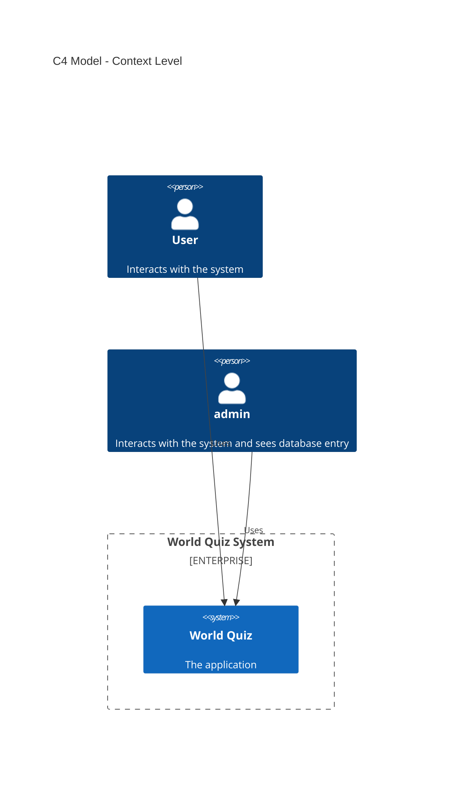
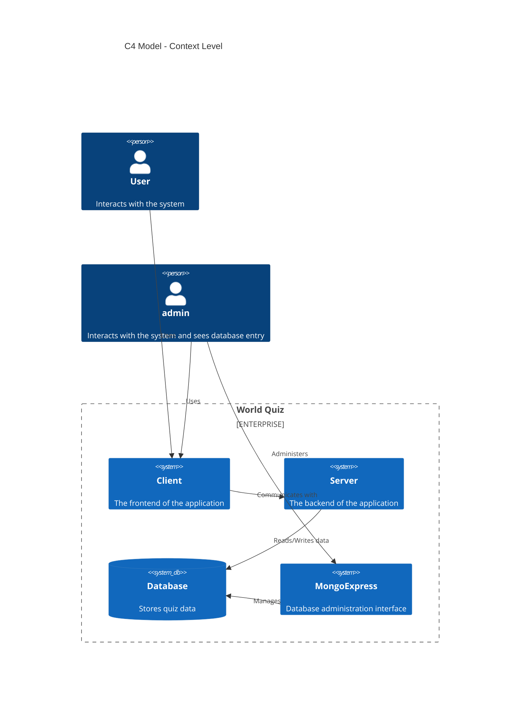
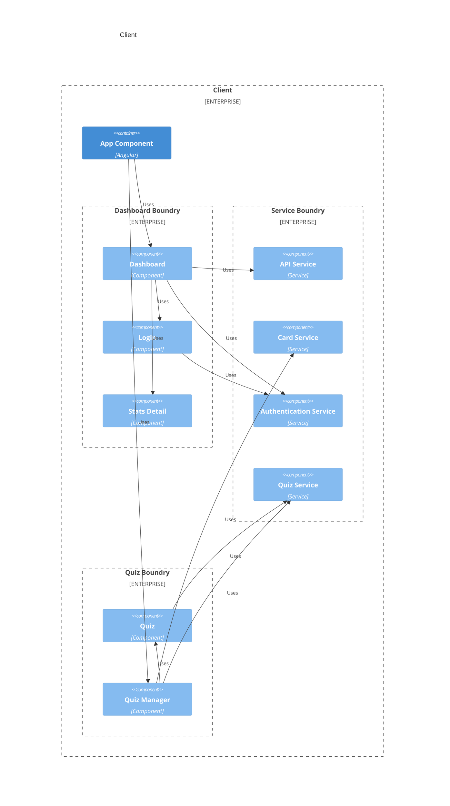
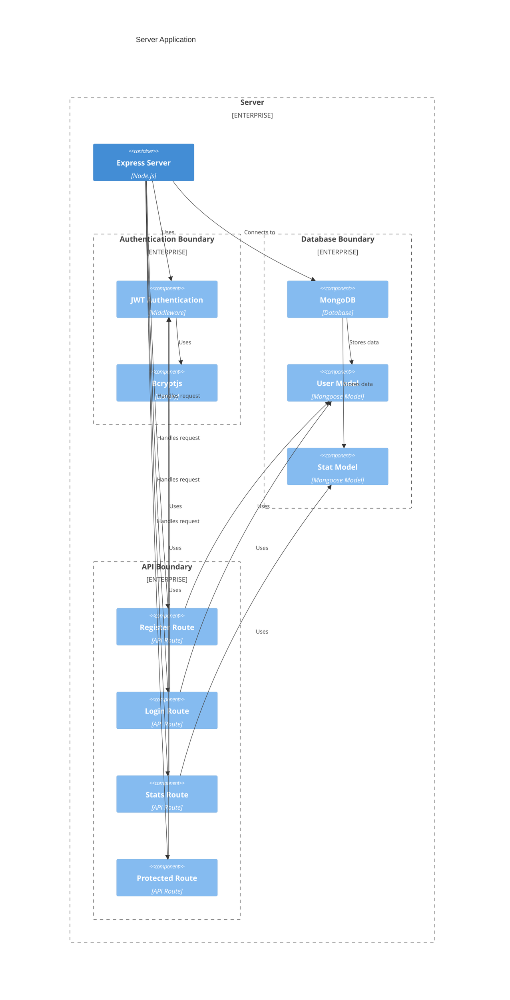
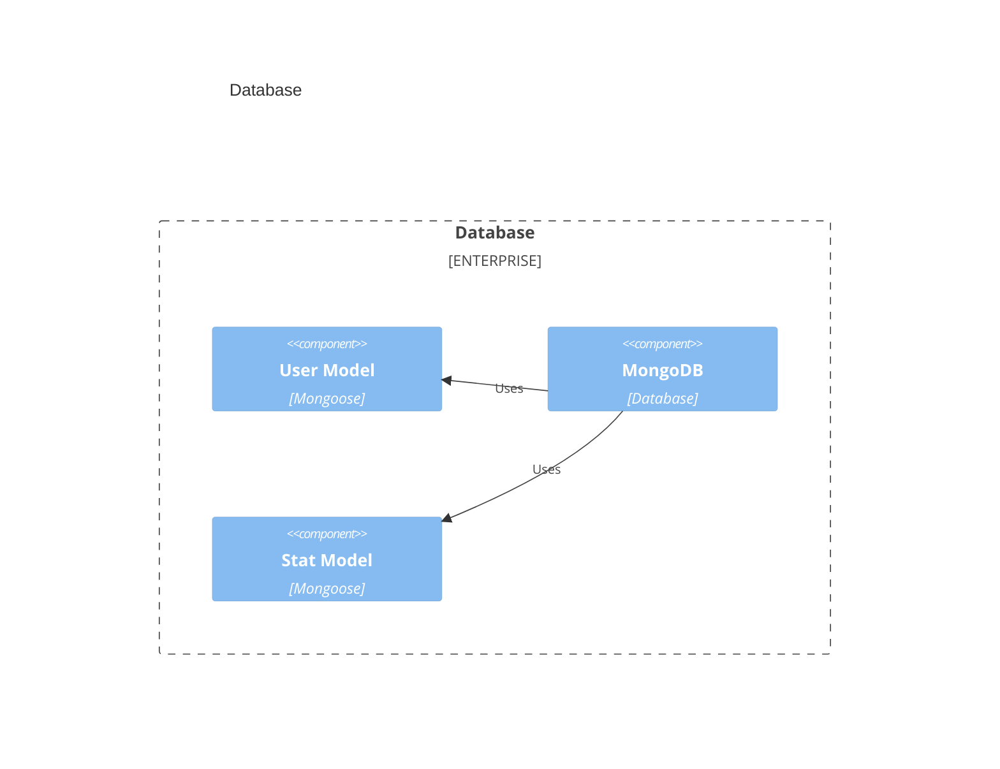

# Architektur Dokumentation

- [Einführung und Ziele](#einführung-und-ziele)
- [Randbedingungen](#randbedingungen)
- [Kontextabgrenzung](#kontextabgrenzung)
- [Lösungsstrategie](#lösungsstrategie)
- [Bausteinsicht](#bausteinsicht)
- [Laufzeitsicht](#laufzeitsicht)
- [Verteilungssicht](#verteilungssicht)
- [Querschnittsthemen](#querschnittsthemen)
- [Entwurfsentscheide](#entwurfsentscheide)
- [Qualitätsanforderungen](#qualitätsanforderungen)
- [Risiken und technische Schulden](#risiken-und-technische-schulden)
- [Glossar](#glossar)

<!-- TODO: Übersicht über die Problemstellung (Auftrag und Ziel). -->

## Einführung und Ziele

### Anforderungen Übersicht

Siehe [Requirements](./Requirements.md)

### Qualitätsziele

### Stakeholders

<!-- TODO: Randbedingungen, welche bei der Lösung eingehalten werden müssen, z.B. bestehende Systeme, welche unterstützt werden müssen oder spezielle Anforderungen, welche den Lösungsraum einschränken. -->

## Randbedingungen

<!-- TODO: Anhand von Datenflüssen beschreiben wie das zu entwickelnde System eingesetzt wird.
Also Daten, welche Benutzer oder umgebende Systeme in das zu entwickelnde System einspeisen oder abgreifen.
Diese Beschreibung wird oft von einem Diagramm unterstützt, Dieses Diagram ist in VSK pflicht!
Hinweis: Hier Benutzerschnittstellen und externe Schnittstellen mit Version spezifizieren. -->

## Kontextabgrenzung

### Business Context

<!--

**<Diagram or Table>**

**<optionally: Explanation of external domain interfaces>**

-->

### Technical Context

<!--

**<Diagram or Table>**

**<optionally: Explanation of technical interfaces>**

**<Mapping Input/Output to Channels>**

-->

<!-- TODO: Gewählter Lösungsansatz mit Begründung beschreiben. Gefragt ist eine sehr kurze Zusammenfassung. -->

## Lösungsstrategie

<!-- TODO: Beschreibung der Bausteinsicht hinzufügen. Für VSK obligatorisch.
In Fall von VSK möchten wir alle vier Ebenen des C4-Modells sehen (Diagramme aber kein Code).
Zu allen Diagrammen wird eine Beschreibung erwartet. -->

## Bausteinsicht

### Whitebox Overall System

### Level 2

### Level 3

#### Client

#### Server

#### Database

## Laufzeitsicht

<!--

### <Runtime Scenario 1>

* _<insert runtime diagram or textual description of the scenario>_
* _<insert description of the notable aspects of the interactions between the
building block instances depicted in this diagram.

-->

<!-- TODO: Beschreibung der Zuordnung von Komponenten zu den Systemen, auf welchen diese eingesetzt werden (auch genannt Deployment- oder Zielsysteme) sowie die Anforderungen an diese Zielsystem(e). Ggf. verschiedene Szenarios. -->

## Verteilungssicht

### Infrastructure Level 1

<!--
_**<Overview Diagram>**_

Motivation

_<explanation in text form>_

Quality and/or Performance Features

_<explanation in text form>_

Mapping of Building Blocks to Infrastructure
_<description of the mapping>_
-->

### Infrastructure Level 2

<!--

#### _<Infrastructure Element 1>_

_<diagram + explanation>_

#### _<Infrastructure Element 2>_

_<diagram + explanation>_

...

#### _<Infrastructure Element n>_

_<diagram + explanation>_
-->

<!-- TODO: Konzepte, welche mehrere Komponenten betreffen (z.B. Schnittstellen, Datenmodell, Testing, Sicherheit) beschreiben.
Hinweise:
- Hier die proprietäre Schnittstelle zwischen LoggerComponent und LoggerServer dokumentieren.
- Hier die Teststrategie dokumentieren (ca. ½ A4-Seite):
- Auf welchem Level (System, Komponente, Unit) wird welche Funktionalität getestet mit Begründung der Wahl.
- Welche Funktionalität wird automatisch getestet und welche manuell mit Begründung der Wahl.
- Welche Funktionalität wird nicht getestet mit Begründung, warum dies kein Problem ist.
- Zusätzliche Informationen, z.B. ob und für welche Funktionalitäten Test-First eingesetzt wird mit Begründung. -->

## Querschnittsthemen

<!--
### _<Concept 1>_

_<explanation>_

### _<Concept 2>_

_<explanation>_

...

### _<Concept n>_

_<explanation>_
-->

<!-- TODO: Entwurfsentscheide auflisten.
Hinweis: Hier die verwendeten Patterns (z.B. Adapter, Strategy) dokumentieren (jeweils mit Diagramm und kurzer Beschreibung).
-->

## Entwurfsentscheide

<!-- TODO: Beschreibung (als Auflistung) der Umsetzung von bekannten und relevanten «nicht funktionalen»-Anforderungen an das zu entwickelnde System.
 Beispiele:
 - Wie garantieren Sie das Ihr System die Antwort (Reply) zu einer Anforderung (Request) innerhalb von maximal 100ms versendet?
 - Wie garantieren Sie, dass Ihr System eine Verfügbarkeit von 99.9% hat?
 - Wie garantieren Sie das Nachrichten, welche vom System, erhalten werden nicht verloren gehen?
 - usw. -->

## Qualitätsanforderungen

### Quality Tree

### Quality Scenarios

<!-- TODO: Listen Sie hier Entscheidungen zu Architektur, Design, Modularisierung, Implementation, und Testing auf, welche später zu Problemen, Einschränkungen oder Mehraufwand in der Verwendung oder Weiterentwicklung der Umsetzung führen können. -->

## Risiken und technische Schulden

## Glossar

| Term | Definition |
| ---- | ---------- |
| x    | x          |
