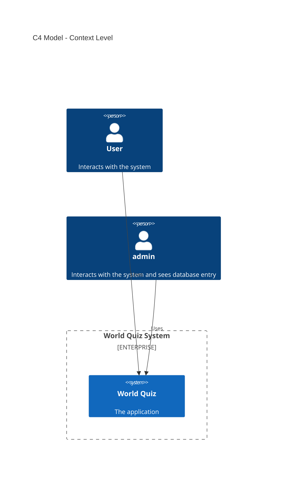
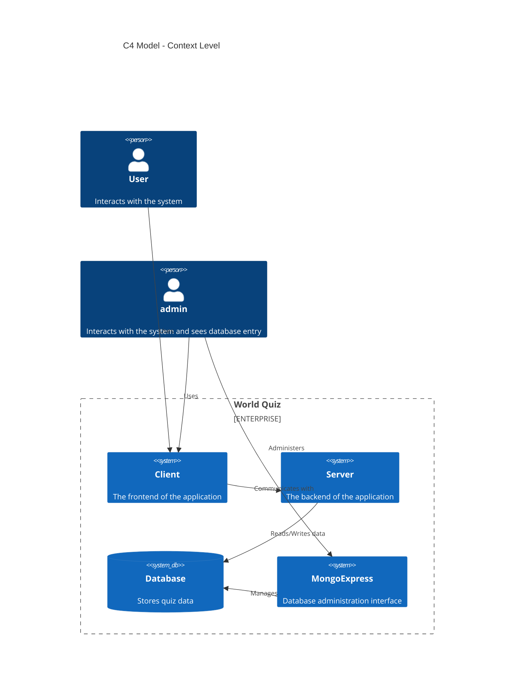
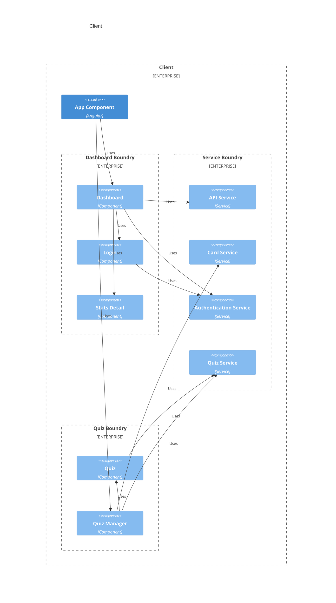
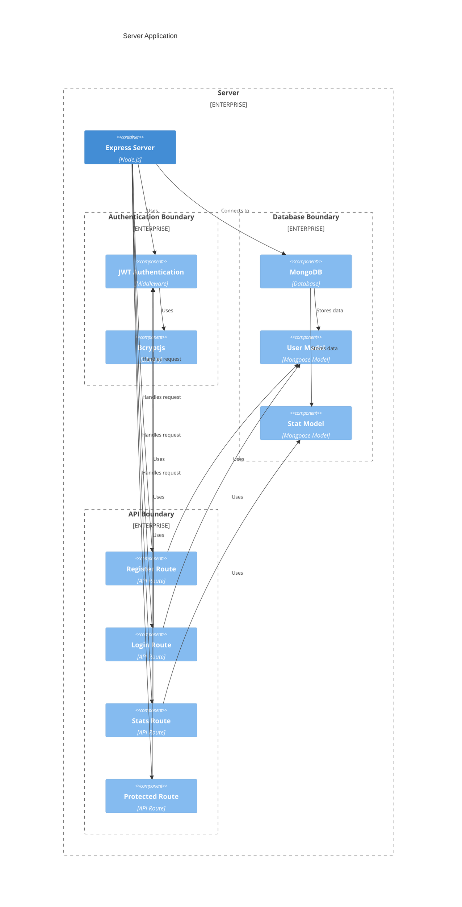
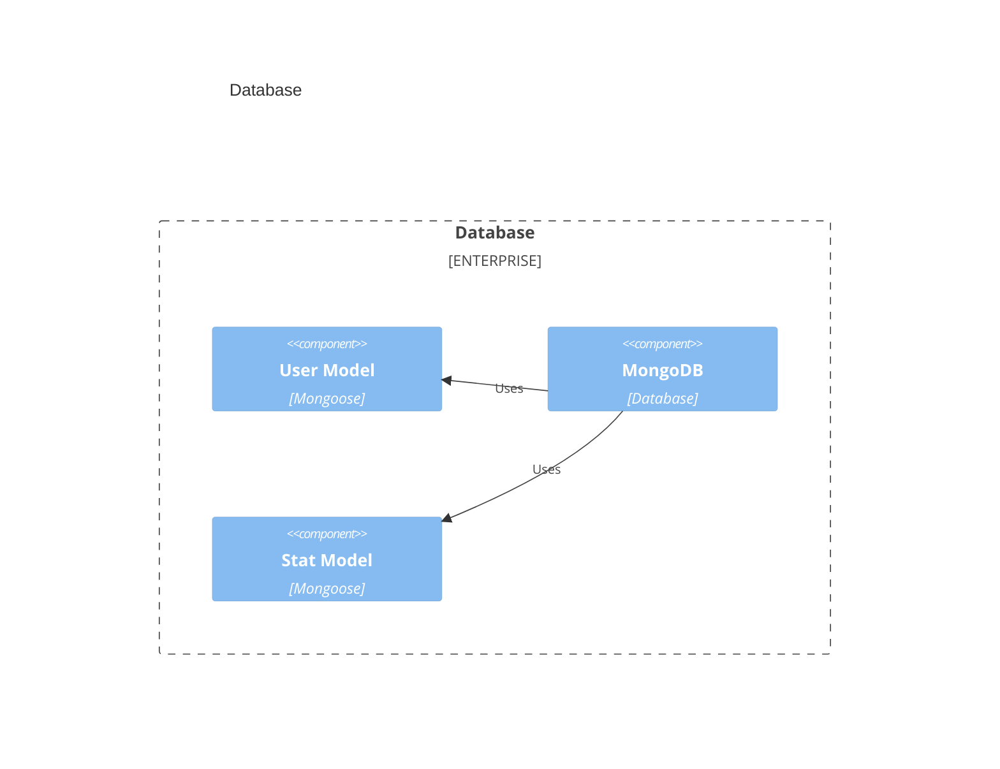
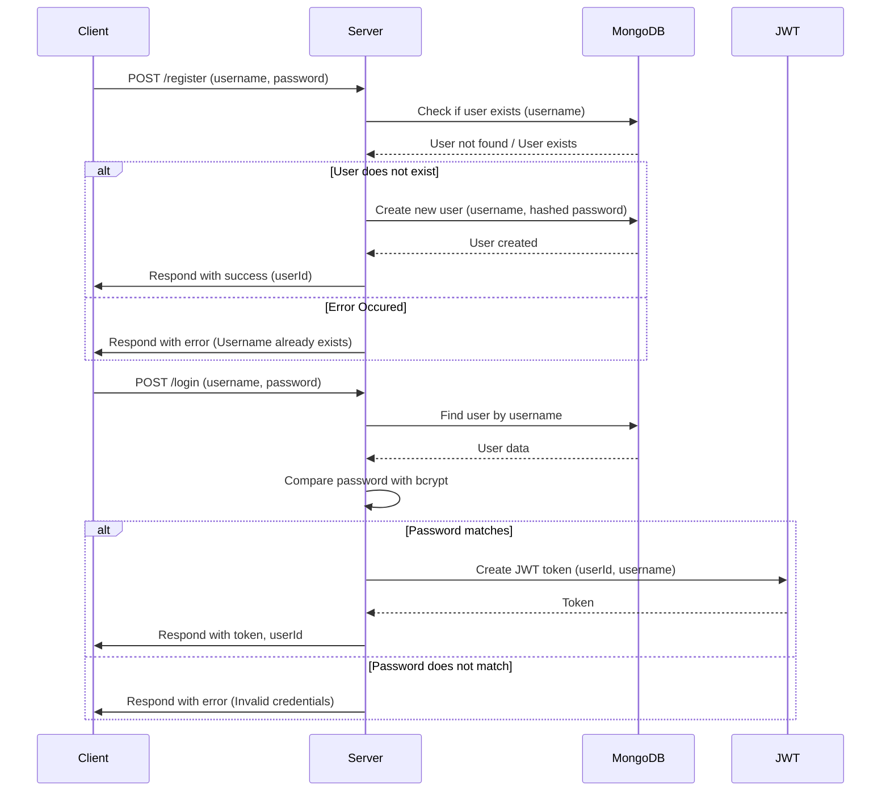
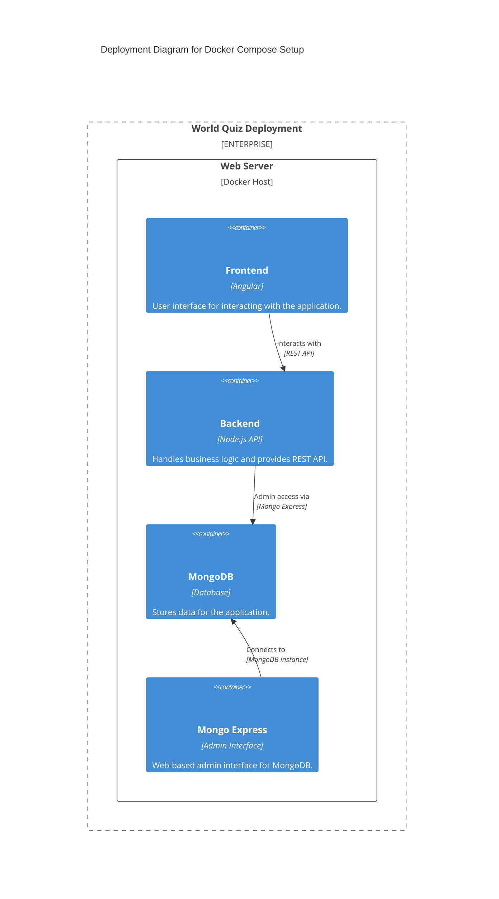

# Architektur Dokumentation

- [Einführung und Ziele](#einführung-und-ziele)
- [Randbedingungen](#randbedingungen)
- [Kontextabgrenzung](#kontextabgrenzung)
- [Lösungsstrategie](#lösungsstrategie)
- [Bausteinsicht](#bausteinsicht)
- [Laufzeitsicht](#laufzeitsicht)
- [Verteilungssicht](#verteilungssicht)
- [Querschnittsthemen](#querschnittsthemen)
- [Entwurfsentscheide](#entwurfsentscheide)
- [Qualitätsanforderungen](#qualitätsanforderungen)
- [Risiken und technische Schulden](#risiken-und-technische-schulden)
- [Glossar](#glossar)

<!-- TODO: Übersicht über die Problemstellung (Auftrag und Ziel). -->

## Einführung und Ziele

World Quiz ist eine interaktive Webanwendung, mit der Benutzer ihr geographisches Wissen testen und erweitern können. Die Anwendung enthält Quizfragen zu verschiedenen Themen wie Länder, Hauptstädte, Kontinente, Meere und US-Bundesstaaten. Die Benutzer können auch motivierende Statistiken einsehen.

### Anforderungen Übersicht

Siehe [Requirements](./Requirements.md)

### Stakeholders

| **Stakeholder**                               | **Beschreibung**                                                                                          | **Interesse**                                                                                                                                          |
| --------------------------------------------- | --------------------------------------------------------------------------------------------------------- | ------------------------------------------------------------------------------------------------------------------------------------------------------ |
| **Endbenutzer (registrierte Benutzer)**       | Personen, die sich registrieren, um Quizfragen zu beantworten und ihr geografisches Wissen zu verbessern. | - Benutzerfreundliche, ansprechende und lehrreiche Erfahrung - Fortschritt und Lernziele verfolgen - Auswahl aus verschiedenen Quizthemen        |
| **Administratoren**                           | Personen, die die Verwaltung und Kontrolle der Benutzerkonten und Quizinhalte übernehmen.                 | - Effiziente Verwaltung der Benutzerkonten - Gleiches wie Endbenutzer                                                                               |
| **Entwickler (Backend, Frontend, Fullstack)** | Personen, die für die Programmierung und Architektur der Webanwendung verantwortlich sind.                | - Wartbare, gut strukturierte Codebasis - Optimierte Leistung (schnelle Ladezeiten) - Mobile Optimierung - Sicherheit der Benutzeranmeldungen |

## Randbedingungen

| **Kategorie**                 | **Randbedingungen**                                                                                                                                                                                                                            |
| ----------------------------- | ---------------------------------------------------------------------------------------------------------------------------------------------------------------------------------------------------------------------------------------------- |
| **Betriebssystem**            | Das Projekt muss auf gängigen Betriebssystemen wie **Linux, macOS und Windows** laufen.                                                                                                                                                        |
| **Programmiersprache**        | Die **Programmiersprache** für das Backend ist **JavaScript** (für Node.js und Express.js) und für das Frontend **TypeScript**, das mit Angular verwendet wird.                                                                                |
| **Framework**                 | Das **Frontend** wird mit **Angular** realisiert, einem beliebten JavaScript-Framework, welches fortlaufend gewartet wird und eine grosse Community hat. Das **Backend** wird mit **Express.js**, einem Web-Framework für Node.js, realisiert. |
| **Datenbank**                 | Die **Datenbank** wird mit der NoSQL-Datenbank **MongoDB** realisiert. Sie ist flexibel bei der Speicherung von JSON-ähnlichen Daten.                                                                                                          |
| **Modul WEB Programming Lab** | Das Projekt ist vom Modul Web Programming Lab, welches im Frühlingssemester 2025 an der Hochschule Luzern durchgeführt wurde.                                                                                                                  |
| **Hosting**                   | Die anwendung wird Lokal must lokal gehosted werden, und mit möglichst wenig aufwand auch auf einem Server Deployed werden können.                                                                                                             |
| **Versionierung**             | Die Versionierung wird mit Git gemacht und der Source Code wird auf Github gehosted.                                                                                                                                                           |
| **Dokumentation**             | Die Dokumentation wird in Markdown geschrieben und ist ebenfalls auf Github ansehbar. gehostet.                                                                                                                                                            |

## Kontextabgrenzung

Das Projekt World Quiz konzentriert sich auf die Entwicklung einer Webanwendung, mit der Benutzer ihr geographisches Wissen testen und erweitern können. Sie umfasst Funktionen wie Benutzerregistrierung, Quizfragen zu verschiedenen geografischen Themen und die Anzeige von Statistiken. Die Anwendung wird lokal gehostet und ist für eine benutzerfreundliche und mobile Nutzung optimiert. Es werden keine externen APIs oder zusätzliche Dienste integriert und die Datenbank für die Speicherung von Benutzerinformationen und Statistiken ist **MongoDB**. Das Projekt konzentriert sich auf die Implementierung der Kernfunktionen, ohne sich mit fortgeschrittenen Themen wie maschinellem Lernen oder tiefgreifender Personalisierung zu befassen.

## Lösungsstrategie

Nach einer umfangreichen Planungsphase wurde zunächst die Grundstruktur des Frontends geschrieben. Ziel ist es, das Quiz unabhängig vom Backend spielen zu können. Danach wurde nach und nach das Backend geschrieben und mit dem Frontend integriert. Anschliessend wurde die Mock-Datenbank im Backend durch die reale Datenbank ersetzt.

## Bausteinsicht

### Level 1

Es gibt zwei arten von Personen (User und Admin), die mit dem "World Quiz System" interagieren. Der User verwendet die Anwendung, während der Admin zusätzlich die Datenbankeinträge einsehen kann. Das System selbst wird als "World Quiz" dargestellt.

### Level 2

Der User nutzt das Frontend, während der Admin zusätzlich die MongoExpress-Oberfläche zur Verwaltung der Datenbank verwendet. Das Frontend kommuniziert mit dem Backend ("Server"), das die Quizdaten und die Benuzer Daten in der Datenbank speichert und abruft. MongoExpress wird für die Datenbankverwaltung eingesetzt.

### Level 3

#### Client

Der Client ist eine App Component, die mit dem Dashboard und dem Quiz interagiert. Zusätzlich gibt es Services, die für die Logik, das Einlesen der Daten und die Kommunikation mit dem Server zuständig sind.

Das Quiz besteht aus dem Quiz Manager, in welchem ein Quiz konfiguriert werden kann, welches dann im Quiz gespielt wird.

Das Dashboard besteht aus der Login Component, wenn der Benutzer noch nicht eingeloggt ist und der Stats Component, wenn er eingeloggt ist.

#### Server

Der Server besteht aus der API, die mit dem Frontend kommuniziert, der Datenbankkomponente und der Authentifizierungskomponente. Die Datenbankkomponente speichert sowohl die Benutzerdaten als auch die Statistiken. Die Authentifizierungskomponente überprüft das Login und ist für die Generierung des Json Web Token verantwortlich.

#### Database

Die Datenbank besteht aus dem User Model, das den Benutzernamen und das Passwort speichert, und dem Stat Model, das die Statistiken nach jedem Spiel speichert.

## Laufzeitsicht

### Server Login

Dieses Flussdiagramm zeigt zwei Hauptprozesse: die Registrierung und die Anmeldung eines Benutzers. 

Der Client sendet eine POST-Anfrage mit Benutzername und Passwort an den Server. Der Server überprüft mittels MongoDB, ob der Benutzername bereits existiert. Wenn der Benutzer nicht existiert, wird ein neuer Benutzer mit dem Benutzernamen und dem gehashten Passwort in der Datenbank angelegt und der Server antwortet dem Client mit einer Erfolgsmeldung und der Benutzer-ID. Wenn der Benutzername jedoch bereits existiert, gibt der Server eine Fehlermeldung zurück.

Der Client sendet eine POST-Anfrage mit Benutzername und Passwort an den Server. Der Server holt die Benutzerdaten von MongoDB und vergleicht das eingegebene Passwort mit dem in der Datenbank gespeicherten gehashten Passwort. Stimmt das Passwort überein, erzeugt der Server ein JWT-Token mit der Benutzer-ID und dem Benutzernamen und sendet es zusammen mit der Benutzer-ID an den Client. Stimmt das Passwort nicht überein, gibt der Server die Fehlermeldung „Ungültige Anmeldeinformationen“ zurück.

## Verteilungssicht

Auf einem Webserver werden vier Container bereitgestellt: der **Frontend Container** (Angular), der die Benutzeroberfläche für die Interaktion mit der Anwendung bereitstellt, der **Backend Container** (Node.js API), der die Geschäftslogik verarbeitet und eine REST API bereitstellt, der **MongoDB Container**, der die Daten der Anwendung speichert, und der **Mongo Express Container**, der eine webbasierte Administrationsoberfläche für MongoDB bereitstellt. Der Backend-Container kommuniziert mit der MongoDB für Datenoperationen und hat auch administrativen Zugriff auf die Datenbank über Mongo Express. Das Frontend interagiert mit dem Backend über die REST API und Mongo Express verbindet sich direkt mit MongoDB für die Administration. Diese Konfiguration gewährleistet eine gut strukturierte und skalierbare Anwendung.

### API

| Methode | Endpoint         | Beschreibung                                                                                          |
|---------|------------------|-------------------------------------------------------------------------------------------------------|
| POST    | /register        | Registriert einen neuen Benutzer mit `username` und `password`. Gibt eine Erfolgsmeldung und Benutzer-ID zurück. |
| POST    | /login           | Meldet einen Benutzer an, indem `username` und `password` überprüft werden. Gibt ein JWT-Token für die Authentifizierung zurück. |
| GET     | /protected       | Ein geschützter Endpunkt, der ein gültiges JWT-Token erfordert. Ist für das Testen vom JWT gedacht. |
| POST    | /stats           | Speichert Benutzerdaten wie `front`, `back`, `attempts`, `date` und `tags`. Erfordert ein JWT-Token. |
| GET     | /stats/latest    | Ruft die letzten 100 Statistiken für den authentifizierten Benutzer ab. Erfordert ein JWT-Token. |

## Querschnittsthemen

- Sicherheit: Ein zentrales Querschnittsthema ist die Sicherheit der Anwendung. Dies umfasst die Implementierung von Authentifizierungsmechanismen wie JWT (JSON Web Tokens) für die Benutzeranmeldung sowie die sichere Speicherung und Verarbeitung von Passwörtern (mittels Bcrypt). Die Datensicherheit wird durch den Zugriffsschutz der MongoDB-Datenbank und die Verwendung verschlüsselter Verbindungen beim Datenaustausch gewährleistet.

- Performance: Für eine gute Performance müssen sowohl das Frontend als auch das Backend optimiert werden. Dies betrifft vor allem die Ladezeiten des Frontends sowie die schnelle und effiziente Datenabfrage im Backend. Hier spielt MongoDB als NoSQL-Datenbank eine Rolle, da sie schnell und flexibel auf grosse Datenmengen zugreifen kann.

- Fehlerbehandlung und Protokollierung: Ein weiteres Querschnittsthema ist die robuste Fehlerbehandlung. Fehler müssen im Backend korrekt behandelt und an den Client kommuniziert werden. Auch ein aussagekräftiges Logging, insbesondere in der Backend-API, ist notwendig, um Probleme schnell identifizieren und beheben zu können.

- Usability und Barrierefreiheit: Ein benutzerfreundliches Design ist für das Frontend von grosser Bedeutung. Insbesondere sollten die Quizfragen für den Nutzer klar verständlich und die Benutzeroberfläche intuitiv bedienbar sein. Einfache Interaktionen und Feedback-Mechanismen sind notwendig, damit der Nutzer schnell zu den gewünschten Informationen gelangt.

## Entwurfsentscheide

### Quiz Logik im Client vs. Server

Während der Entwicklung wurde entschieden, dass die Quizfragen im Backend und nicht im Frontend geladen werden. Diese Entscheidung hat mehrere Konsequenzen: Einerseits bedeutet dies, dass die Quizfragen im Frontend nicht mehr benutzerspezifisch abgerufen werden können oder dies zumindest erschwert wird. Andererseits führt diese Architektur zu einer geringeren Abhängigkeit des Frontends vom Backend. Diese Unabhängigkeit ermöglicht es, das Quiz auch dann zu spielen, wenn keine stabile Verbindung zum Backend besteht, was die Flexibilität und Benutzerfreundlichkeit erhöht. Diese Entscheidung berücksichtigt also sowohl die Benutzererfahrung als auch die Robustheit des Systems.

## Qualitätsanforderungen

Siehe [Requirements](./Requirements.md)

## Risiken und technische Schulden

- Technische Schulden: Diese entstehen oft durch schnelle und nicht nachhaltige Implementierungen. Ein Beispiel in diesem Projekt könnte der schnelle Wechsel von einer Mock-Datenbank zu einer echten MongoDB-Datenbank sein, ohne ausreichende Testabdeckung oder Performancetests durchzuführen. Solche Entscheidungen können später zu unerwarteten Problemen wie Dateninkonsistenzen oder Performanceeinbussen führen.

- Komplexität des Systems: Die Implementierung mehrerer Schichten (Frontend, Backend, Datenbank) und deren Kommunikation kann die Komplexität erhöhen. Dies bedeutet, dass mit zunehmender Funktionalität die Wartung schwieriger wird, wenn nicht regelmässig Refaktorisierungen und Optimierungen durchgeführt werden.

- Skalierbarkeit: Das System ist derzeit auf eine lokale Umgebung ausgerichtet, was die Skalierbarkeit einschränken könnte, insbesondere wenn die Anzahl der Nutzer stark ansteigt. Ein Risiko ist die mögliche Verschlechterung der Performance bei hoher Last, wenn keine ausreichenden Massnahmen zur Lastverteilung oder Caching-Techniken implementiert werden.

- Abhängigkeiten: Abhängigkeiten von Drittanbietern, wie z.B. MongoDB und MongoExpress, können zu Risiken führen, wenn zukünftige Versionen inkompatibel sind oder Sicherheitslücken aufweisen. Daher ist es wichtig, regelmässige Updates und Tests durchzuführen, um diese Risiken zu minimieren.

- Sicherheit: Ein weiteres Risiko ist die mangelnde Absicherung von Daten und APIs. Wenn Sicherheitsmechanismen wie JWT oder Passwortschutz nicht korrekt implementiert oder gewartet werden, kann dies zu unberechtigten Zugriffen und Datenlecks führen.

### Reflextion

Ich habe bei diesem Projekt viel über das Frontend gelernt, vor allem über TypeScript, JWT und Angular. Es war eine Herausforderung mit JavaScript oder TypeScript im Backend zu arbeiten, da ich lieber mit vertrauten Technologien wie Java oder Python gearbeitet hätte. So hätte ich die gewonnene Zeit im Frontend nutzen können. 

Trotzdem war es eine wertvolle Erfahrung, da ich gezwungen war, neue Konzepte und Frameworks zu lernen. Besonders spannend fand ich die Arbeit mit APIs, MongoDB und JSON-Datenmodellen sowie die Implementierung der JWT-Authentifizierung. Dies hat mein Verständnis für Websicherheit und Benutzerdatenmanagement vertieft. 

Obwohl das Backend nicht meine bevorzugte Sprache war, habe ich viel darüber gelernt, wie man APIs strukturiert und Datenbanken verwaltet. Die Arbeit mit Angular und die Integration von Frontend und Backend haben mir geholfen, meine Fähigkeiten in der Entwicklung von interaktiven Webanwendungen zu verbessern. Alles in allem hat mir das Projekt geholfen, meine Webentwicklungsfähigkeiten zu erweitern und neue Technologien zu entdecken.

Ich freue mich schon, nach dem Web Lab Modul an diesem Projekt weiter arbeiten zu können.

## Glossar

| Term | Definition |
| ---- | ---------- |
| x    | x          |
